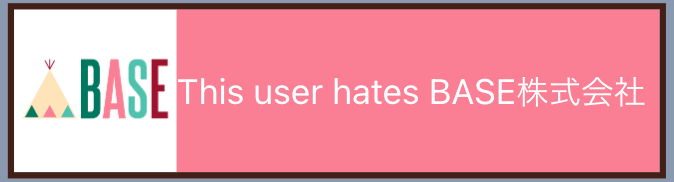
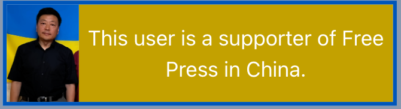
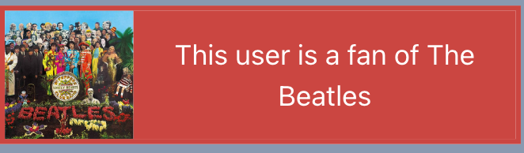

## Description

`stereotype` is a tool that you can easily create wiki-style userbox and integrate it into your own website or share with other people.

## What's Userbox

A userbox is a descriptive tag for other people to understand you better. Here're some examples of userbox.

try long text try long text try long text try long text try long text try long text try long text try long text try long text try long text try long text try long text try long text try long text try long text 

